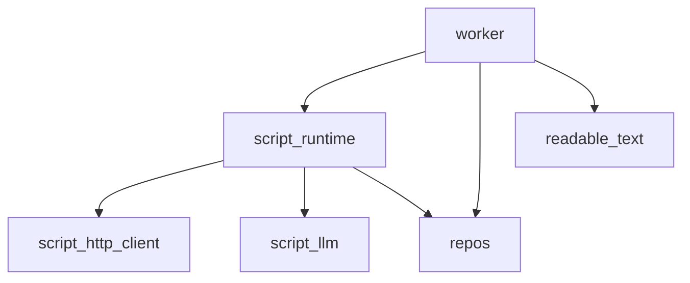
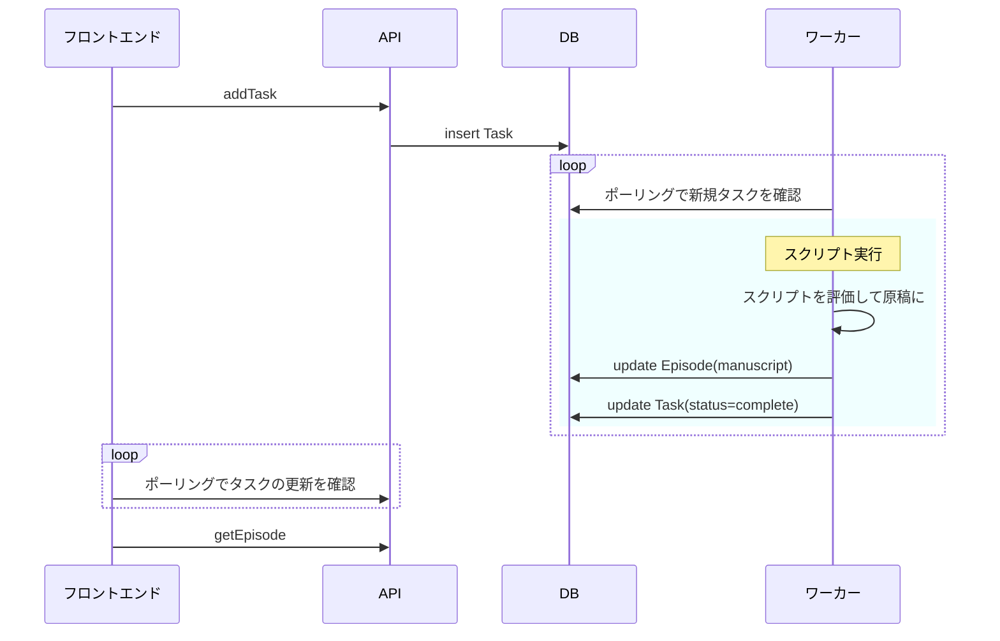
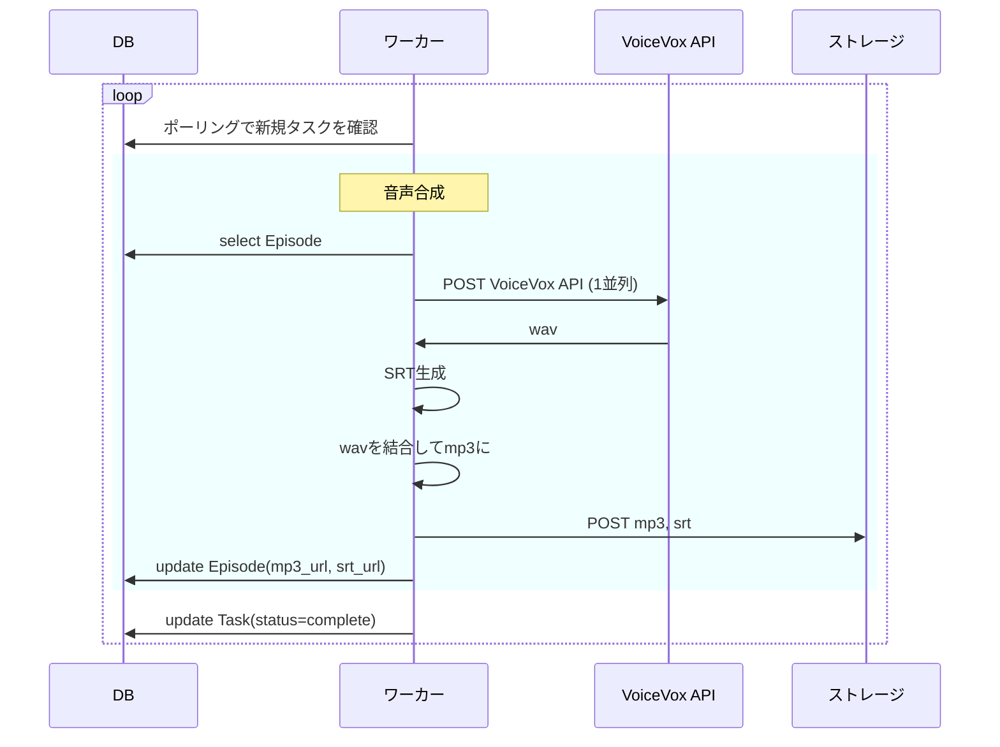

# Botcast

Botcast の機能メモとか設計メモとか

- frontend/API: <https://github.com/wakame-tech/botcast>
- worker: <https://github.com/wakame-tech/botcast-worker>

## 技術構成

- frontend
  - React
  - TanStack Router
  - tRPC
  - unocss
  - デプロイ先: Deno Deploy(`/dist` を静的ファイルとして)
- API
  - Deno
  - Prisma + Prisma Accelerate
  - supabase
  - デプロイ先: Deno Deploy
- worker
  - Cloudflare R2
  - デプロイ先: 自宅のUbuntuマシン

## 機能

- ユーザー(`User`)作成・ログインが出来る
- ユーザーはポッドキャスト(`PodCast`) を作成できる
- ポッドキャストは複数のエピソード(`Episode`) からなる
- エピソード原稿を作成できる
  - Webページから: HTMLを取得して原稿に変換
  - アップロードする: Markdownをアップロード
- エピソード原稿をスクリプトで作成できる

### 画面

- エピソード一覧画面
  - エピソード
    - タイトル
    - 作成日時
    - 長さ
    - 投稿者: `User`
    - 原稿
- エピソード詳細画面
  - 音声ファイル
  - 原稿
    - 再生中の行がハイライトされる
    - 指定した行から再生できる
  - 音声プレイヤー


## ワーカー

- DBにキューイングされたタスクを順次実行する

### crate依存関係



### スクリプト評価

- TODO: ワーカーがAPIを公開していないのでDBを介したポーリングになってしまっていて微妙



### 音声生成タスク



### スクリプト機能

- 外部のURLやAPI呼び出し等のみならずサービス内のデータもURNによって参照できる
  - お便り機能や他番組への言及・コラボ(どうやって?)等
  - TODO: 認可
- [JSON-eのフォーク](https://github.com/wakame-tech/json-e/tree/fix-pub-context) で非同期で実行される
  - TODO: タイムアウトをつける

#### 原稿

```typescript
type Section =
  {
    type: 'Serif',
    speaker: string,
    text: string,
  }

interface Manuscript {
  title: string;
  sections: Section[];
}
```

## 日記

### Sprint 2024-08-21

- 技術選定した
- Deno Deploy でフロントエンド/APIのCDを作り、空ページをデプロイした #3
- supabaseをセットアップ #5
- Prismaセットアップ
- フロントエンドセットアップ
- 最小のワーカーを書いた #11

### Sprint 2024-08-28

- Cloudflare R2 をセットアップして音声をアップロードできるようにした
  - [s3](https://crates.io/crates/rust-s3) crateで
- compose-cd でワーカーのCDを作った
- Task APIを実装した

### Sprint 2024-09-04

- supabase でユーザー認証とAPI認証を実装した #17
  - [@supabase/auth-ui-react](https://www.npmjs.com/package/@supabase/auth-ui-react) で

### Sprint 2024-09-11

- UTF-8以外のHTMLに対応 #6
- HTML→MD変換する実装を変えた #9
- 音声のタイムスタンプ計算を実装した #30

### Sprint 2024-09-18

- PRをレビューしてくれるBotを作って導入した #32
- ARCHITECTURE.md を作った #37
- SRTファイルを生成するようにした #30
- `shadcn/ui` を使ってUIを作り直した #41

### Sprint 2024-09-25

- 進捗ないです...

### Sprint 2024-10-02

- head, styleタグを除外するように修正
- 今後のためにスクレイピングタスクと音声合成タスクを分離中 #15
- LLMで原稿を変換したい: とりあえず要約

### Sprint 2024-10-09

- スクリプト実行機能
  - HTML取得やLLM利用はスクリプトで表現する
  - 原稿生成と音声生成を分離した
- コメント機能
