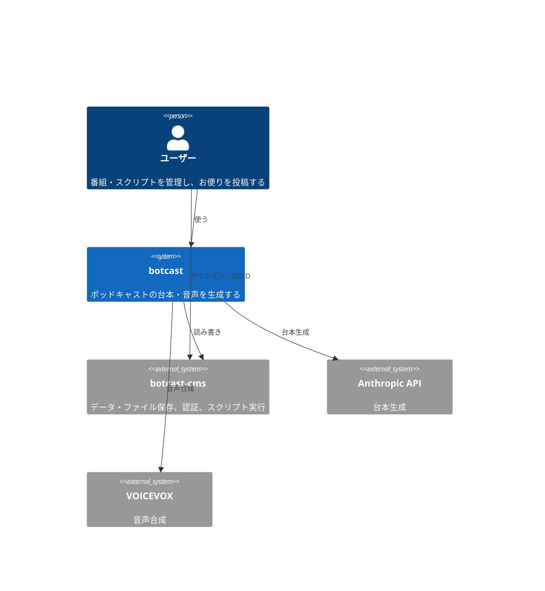
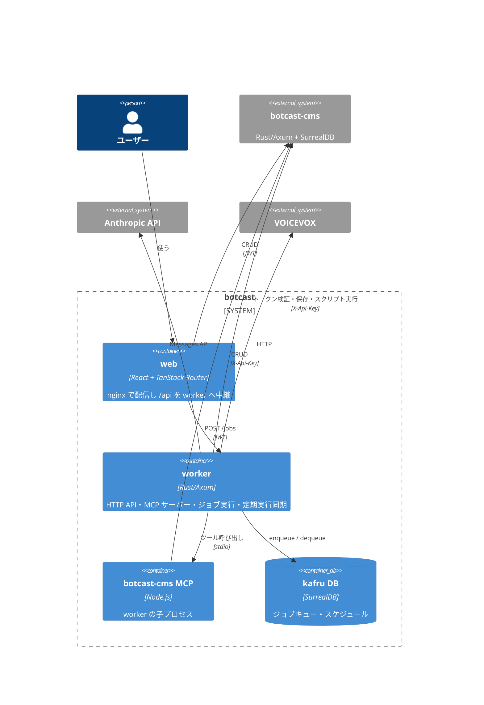
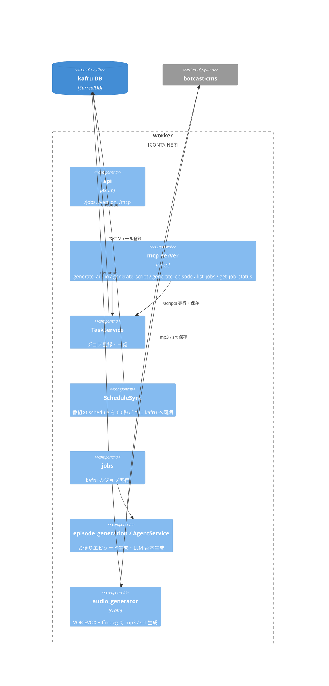

# アーキテクチャ

C4 モデルで記述する。

## Context

```mermaid
C4Context
  Person(user, "ユーザー", "番組・スクリプトを管理し、お便りを投稿する")
  System(botcast, "botcast", "ポッドキャストの台本・音声を生成する")
  System_Ext(cms, "botcast-cms", "データ・ファイル保存、認証、スクリプト実行")
  System_Ext(claude, "Anthropic API", "台本生成")
  System_Ext(voicevox, "VOICEVOX", "音声合成")

  Rel(user, botcast, "使う")
  Rel(user, cms, "サインイン / CRUD")
  Rel(botcast, cms, "読み書き")
  Rel(botcast, claude, "台本生成")
  Rel(botcast, voicevox, "音声合成")
```

## Container

```mermaid
C4Container
  Person(user, "ユーザー")
  System_Ext(cms, "botcast-cms", "Rust/Axum + SurrealDB")
  System_Ext(claude, "Anthropic API")
  System_Ext(voicevox, "VOICEVOX")

  System_Boundary(b, "botcast") {
    Container(web, "web", "React + TanStack Router", "nginx で配信し /api を worker へ中継")
    Container(worker, "worker", "Rust/Axum", "HTTP API・MCP サーバー・ジョブ実行・定期実行同期")
    Container(mcp, "botcast-cms MCP", "Node.js", "worker の子プロセス")
    ContainerDb(kafru, "kafru DB", "SurrealDB", "ジョブキュー・スケジュール")
  }

  Rel(user, web, "使う")
  Rel(web, cms, "CRUD", "JWT")
  Rel(web, worker, "POST /jobs", "JWT")
  Rel(worker, cms, "トークン検証・保存・スクリプト実行", "X-Api-Key")
  Rel(worker, mcp, "ツール呼び出し", "stdio")
  Rel(mcp, cms, "CRUD", "X-Api-Key")
  Rel(worker, kafru, "enqueue / dequeue")
  Rel(worker, claude, "Messages API")
  Rel(worker, voicevox, "HTTP")
```

## Component (worker)

```mermaid
C4Component
  Container_Boundary(w, "worker") {
    Component(api, "api", "Axum", "/jobs, /version, /mcp")
    Component(mcpsrv, "mcp_server", "rmcp", "generate_audio / generate_script / generate_episode / list_jobs / get_job_status")
    Component(task, "TaskService", "", "ジョブ登録・一覧")
    Component(sync, "ScheduleSync", "", "番組の schedule を 60 秒ごとに kafru へ同期")
    Component(jobs, "jobs", "", "kafru のジョブ実行")
    Component(gen, "episode_generation / AgentService", "", "お便りエピソード生成・LLM 台本生成")
    Component(audio, "audio_generator", "crate", "VOICEVOX + ffmpeg で mp3 / srt 生成")
  }
  ContainerDb(kafru, "kafru DB", "SurrealDB")
  System_Ext(cms, "botcast-cms")

  Rel(api, task, "")
  Rel(mcpsrv, task, "")
  Rel(task, kafru, "enqueue")
  Rel(sync, kafru, "スケジュール登録")
  Rel(jobs, kafru, "dequeue")
  Rel(jobs, gen, "")
  Rel(jobs, audio, "")
  Rel(gen, cms, "/scripts 実行・保存")
  Rel(audio, cms, "mp3 / srt 保存")
```
