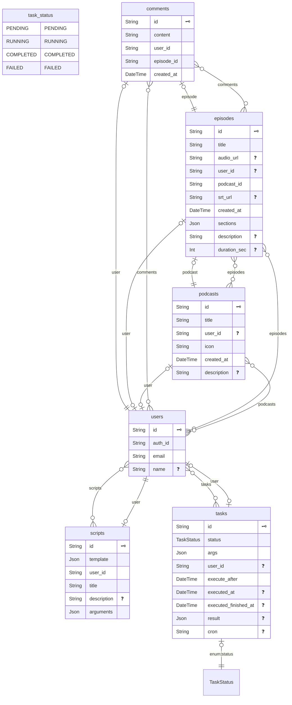

```mermaid
erDiagram

        task_status {
            PENDING PENDING
RUNNING RUNNING
COMPLETED COMPLETED
FAILED FAILED
        }
    
  "comments" {
    String id "🗝️"
    String content 
    String user_id 
    String episode_id 
    DateTime created_at 
    }
  

  "episodes" {
    String id "🗝️"
    String title 
    String audio_url "❓"
    String user_id "❓"
    String podcast_id 
    String srt_url "❓"
    DateTime created_at 
    Json sections 
    String description "❓"
    Int duration_sec "❓"
    }
  

  "podcasts" {
    String id "🗝️"
    String title 
    String user_id "❓"
    String icon 
    DateTime created_at 
    String description "❓"
    }
  

  "scripts" {
    String id "🗝️"
    Json template 
    String user_id 
    String title 
    String description "❓"
    Json arguments 
    }
  

  "tasks" {
    String id "🗝️"
    TaskStatus status 
    Json args 
    String user_id "❓"
    DateTime execute_after 
    DateTime executed_at "❓"
    DateTime executed_finished_at "❓"
    Json result "❓"
    String cron "❓"
    }
  

  "users" {
    String id "🗝️"
    String auth_id 
    String email 
    String name "❓"
    }
  
    "comments" o|--|| "episodes" : "episode"
    "comments" o|--|| "users" : "user"
    "episodes" o{--}o "comments" : "comments"
    "episodes" o|--|| "podcasts" : "podcast"
    "episodes" o|--|o "users" : "user"
    "podcasts" o{--}o "episodes" : "episodes"
    "podcasts" o|--|o "users" : "user"
    "scripts" o|--|| "users" : "user"
    "tasks" o|--|| "TaskStatus" : "enum:status"
    "tasks" o|--|o "users" : "user"
    "users" o{--}o "comments" : "comments"
    "users" o{--}o "episodes" : "episodes"
    "users" o{--}o "podcasts" : "podcasts"
    "users" o{--}o "scripts" : "scripts"
    "users" o{--}o "tasks" : "tasks"
```
