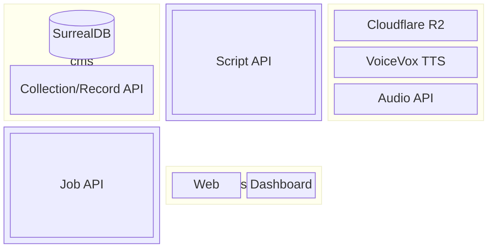

# Architecture

## 設計方針

[Issue #91: Tracking Issue リーアキテクチャ](https://github.com/wakame-tech/botcast/issues/91) に基づくリアーキテクチャ。

### 背景

旧 botcast-worker では「スクリプト機能が LLM を呼び出す」構造だったが、LLM Agent が Tool Call / MCP で外部ツールを直接操作できるようになったため、**「LLM Agent がスクリプト機能・データストアを使う」** 形に逆転させる。

### 設計原則

| 原則 | 内容 |
|---|---|
| **MCP ファースト** | LLM Agent が MCP 経由でデータ操作・スクリプト実行を行う主要インターフェース |
| **プラットフォーム汎用化** | 旧来のドメインモデル (Podcast/Episode/Corner/Mail/Script) を汎用 Collection/Record に一般化 |
| **責務の分離** | 認証・ファイル管理はアプリ固有。CMS は構造化データの保存・実行に専念 |
| **スクリプト実行** | 独自 DSL ランタイムを廃止し Dify Sandbox (Python/Node.js) に移行。小さい実行単位で LLM Agent が即時利用 |

---

## システム全体構成



---

## botcast-cms

構造化データの保存・生成・スクリプト実行をプラットフォームとして提供する。アプリ非依存。

| コンポーネント | ディレクトリ | 役割 |
|---|---|---|
| **TypeSpec** | `spec/` | API 仕様定義 (`.tsp`) → OpenAPI YAML 生成 |
| **CMS API** | `cms/crates/api/` | REST API サーバー。Collection/Record/Script/Job のエンドポイントを提供 |
| **Worker** | `cms/crates/worker/` | kafru ベースのジョブキュー。バックグラウンド処理を実行 |
| **MCP Server** | `mcp/` | CMS API を MCP ツールとしてラップ。LLM Agent に公開 |
| **Admin UI** | `web/` | 管理ダッシュボード。Collection・Record・Job・Script の操作 |

### API エンドポイント

| リソース | 操作 | 概要 |
|---|---|---|
| `Collection` | CRUD | JSON Schema 付きコレクション管理 |
| `Record` | CRUD + `/generate` | スキーマバリデーション付きレコード管理。`/generate` で OpenAI Structured Output による自動生成 |
| `Script` | `POST /scripts` | Dify Sandbox 経由で Python / Node.js を同期実行 |
| `Job` | `GET /jobs`, `POST /jobs` | ジョブキューへのエンキューと一覧取得 |

### MCP ツール一覧

| ツール | 対応エンドポイント |
|---|---|
| `CollectionApi_create` / `delete` | `POST/DELETE /collections` |
| `RecordApi_list` / `create` / `read` / `update` / `delete` / `generate` | `/records/{collectionId}` |
| `ScriptApi_execute` | `POST /scripts` |
| `JobApi_list` / `create` | `GET/POST /jobs` |

---

## botcast

botcast-cms を構造化データストアとして利用するポッドキャスト生成アプリケーション。

| コンポーネント | ディレクトリ | 役割 |
|---|---|---|
| **LLM Agent** | — | MCP 経由で CMS を操作してコンテンツ生成・データ管理を行う |
| **API** | `botcast-worker/crates/api/` | ポッドキャスト固有ビジネスロジック。Podcast/Episode/Task 管理・Supabase 認証 |
| **Worker** | `botcast-worker/crates/worker/` | 音声合成 (VoiceVox + FFmpeg) → Cloudflare R2 アップロード |

### botcast がアプリ固有で管理するもの（CMS 外）

| 責務 | 手段 |
|---|---|
| 認証・ユーザー管理 | Supabase Auth |
| ファイル管理 | Cloudflare R2 (音声・SRT) |
| 音声合成 | VoiceVox TTS + FFmpeg |

---

## web

ユーザー向けの botcast フロントエンド。botcast API を介して Podcast・Episode・Task を操作する。

| コンポーネント | ディレクトリ | 役割 |
|---|---|---|
| **Web** | `web/` | React / Vite SPA。TanStack Router でルーティング・Supabase Auth でログイン管理 |

---

## socia データモデルとの互換性調査

### socia のデータモデル概要

socia は以下のエンティティ群と、それらの間の関係を持つ。

| エンティティ | 主なフィールド | 関係 |
|---|---|---|
| `UserAccount` | name, bio, rank, resources(JSONB), parties(JSONB), last_stamina_recovered_at | → UserCharacter (1:N) |
| `Character` | name, attributes(JSONB), avatar_url | ← UserCharacter (N:1) |
| `UserCharacter` | user_id, character_id, rarity, exp, level, max_hp, attack | FK → UserAccount, Character |
| `Item` | name, kind(enum), attributes(JSONB), avatar_url, quest_ids(JSONB) | |
| `Mail` | from_user_id, to_user_id, title, content, attachments(JSONB) | FK → UserAccount (×2) |
| `World` | name, begin_at, end_at | ← Quest (1:N) |
| `Quest` (SociaQuest) | world_id, name, difficulty, stamina_cost, status | FK → World |
| `Gacha` (SociaGacha) | name, gems_cost_single/multi, begin_at, end_at, character_ids(UUID[]) | |
| `Mission` | title, rewards(Resources[]), successors(UUID[]) | |
| `UserMissions` | achieved(UUIDセット), challenging(UUIDセット) | |
| `user_follows` | follower_id, following_id | 複合PK, FK → UserAccount (×2) |

### 現在の botcast-cms で対応できないこと

#### 1. コレクション間リレーション／参照整合性の欠如

botcast-cms の Record はコレクション単体で管理される。外部キー制約・参照整合性の保証がなく、`user_characters.user_id` が実在する `user_accounts` レコードを指すことを保証できない。

#### 2. フィルタリング・ソート・ページネーションの欠如

現在の Record 取得 API (`GET /records/{collectionId}`) は全件返却のみ。socia では「特定ユーザーのキャラクター一覧」「特定ワールドのクエスト一覧」「未読メール一覧」などの条件クエリが必須だが、現在 botcast-cms にはフィルタ機能がない。

#### 3. トランザクションサポートの欠如

ガチャ実行（gems 消費 + UserCharacter 追加 + Mail 送付）やクエスト報酬付与（stamina 消費 + Resources 加算）のような複数 Collection にまたがる原子的更新は、現在のAPIでは保証できない。

#### 4. 多対多関係テーブルの表現困難

`user_follows` のような複合主キーを持つ関係テーブルを Collection/Record モデルで自然に表現できない。複合ユニーク制約も現時点では未サポート。

#### 5. 認証・ユーザースコープのアクセス制御の欠如

socia ではユーザーが自身のデータ（UserCharacter, Mail, UserMissions 等）のみ参照・更新できる必要があるが、現在の botcast-cms API には認証・認可機構がない。

#### 6. Enum・バリデーション制約の弱さ

`ItemKind`（Consumable / Material）のような Rust enum は JSON Schema の `enum` で表現できるが、`stamina_cost >= 0` などの数値制約や、相互依存する複合バリデーションロジックは JSON Schema 単体では表現・強制が困難。

### socia データを保存するために必要な機能追加

botcast-cms を socia のデータストアとして利用するには、以下の機能追加が必要。

| 優先度 | 機能 | 概要 |
|---|---|---|
| 高 | **クエリフィルタリング** | `GET /records/{collectionId}?filter=...` でフィールド条件・ソート・ページネーションをサポート (SurrealDB の `WHERE` 句を活用) |
| 高 | **コレクション間リレーション** | Collection の JSON Schema に `$ref` 形式でコレクション参照を定義し、Record 保存時に参照先の存在チェックを行う |
| 高 | **認証・アクセス制御** | JWT (Supabase Auth 互換) による認証と、Record へのオーナーシップ属性 (`owner_id`) に基づくスコープフィルタリング |
| 中 | **トランザクション API** | `POST /transactions` で複数の Record 操作をアトミックに実行。SurrealDB のトランザクション機能を利用 |
| 中 | **複合インデックス・ユニーク制約** | Collection スキーマに `uniqueKeys` を定義し、`user_follows` のような複合ユニーク制約をサポート |
| 低 | **型サポートの拡張** | UUID 配列型フィールド (`character_ids uuid[]`) の JSON Schema 表現と、コレクション参照の配列版サポート |

---

## データフロー例

### LLM Agent によるレコード生成

```
LLM Agent
  → (MCP) RecordApi_generate
  → CMS API  POST /records/{collectionId}/generate
  → OpenAI gpt-4o (Structured Output)
  → SurrealDB にレコード保存
  → 生成結果を Agent に返却
```

### LLM Agent によるスクリプト実行

```
LLM Agent
  → (MCP) ScriptApi_execute
  → CMS API  POST /scripts
  → Dify Sandbox (Python / Node.js 同期実行)
  → 実行結果を Agent に即時返却
```

### botcast でのエピソード音声生成

```
botcast Worker
  → VoiceVox TTS (テキスト → 音声)
  → FFmpeg (音声エンコード)
  → Cloudflare R2 (MP3 / SRT アップロード)
  → botcast API で episode.audio_url 更新
```
