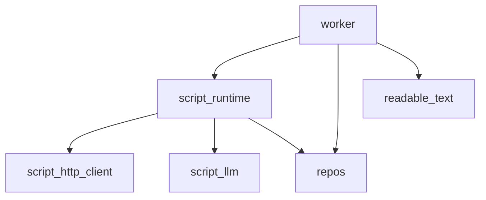
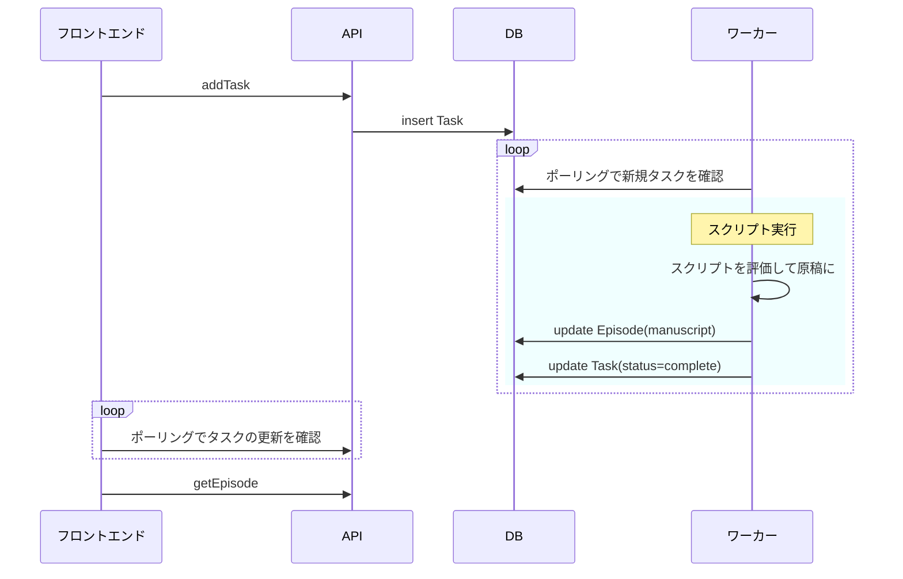
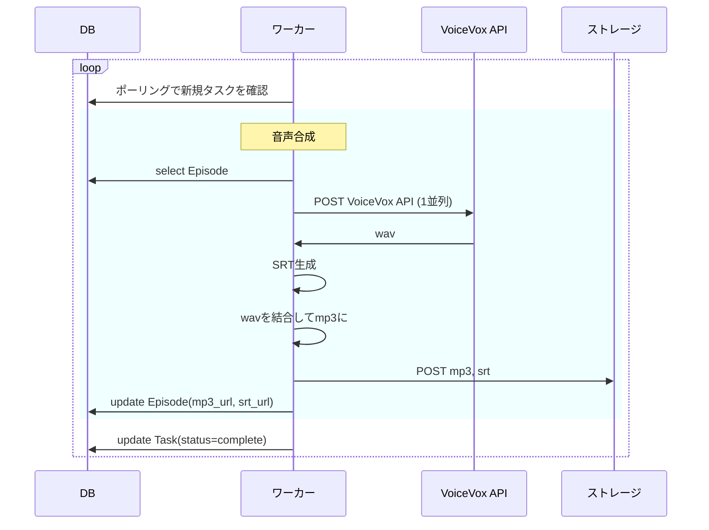

# ワーカー

- DBにキューイングされたタスクを順次実行する

## crate依存関係

```mermaid
graph TD;
  worker --> script_runtime;
  worker --> repos;
  worker --> readable_text;
  script_runtime --> script_http_client;
  script_runtime --> script_llm;
  script_runtime --> repos;
```

## スクリプト評価

- TODO: ワーカーがAPIを公開していないのでDBを介したポーリングになってしまっていて微妙

```mermaid
sequenceDiagram
    participant web as フロントエンド
    participant api as API
    participant db as DB
    participant worker as ワーカー

    web ->> api: addTask
    api ->> db: insert Task

    loop
      worker ->> db: ポーリングで新規タスクを確認
      rect azure
        note over worker: スクリプト実行
        worker ->> worker: スクリプトを評価して原稿に
        worker ->> db: update Episode(manuscript)
        worker ->> db: update Task(status=complete)
      end
    end

    loop
      web ->> api: ポーリングでタスクの更新を確認
    end
    
    web ->> api: getEpisode
```

## 音声生成タスク

```mermaid
sequenceDiagram
    participant db as DB
    participant worker as ワーカー
    participant voicevox as VoiceVox API
    participant storage as ストレージ
 
    loop
      worker ->> db: ポーリングで新規タスクを確認
      rect azure
        note over worker: 音声合成
        worker ->> db: select Episode
        worker ->> voicevox: POST VoiceVox API (1並列)
        voicevox ->> worker: wav
        worker ->> worker: SRT生成
        worker ->> worker: wavを結合してmp3に
        worker ->> storage: POST mp3, srt
        worker ->> db: update Episode(mp3_url, srt_url)
      end

      worker ->> db: update Task(status=complete)
    end 
```
